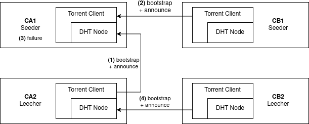

# BitTorrent 4 SCION - DHT Field Setup

This repository contains Ansible playbooks for an automated field test of the Mainline DHT functionality for a BitTorrent over SCION client.

This test setup was designed for a study at the Otto-von-Guericke-University. For further information, please refer to the study.

## Links:
* [Study - Modification of an DHT implementation for BitTorrent for the use in SCIONLab](tbd)
* [BitTorrent 4 SCION client](https://github.com/martenwallewein/torrent-client)
* [Mainline DHT 4 SCION lib](https://github.com/netsys-lab/dht)
* [SCIONLab](https://docs.scionlab.org/)
* [Ansible](https://docs.ansible.com/)

## Field setup preparation and execution
* setup SCION ISDs hosts and (see [SCIONLab](https://docs.scionlab.org/))
* setup go 1.16 on each host
* create a inventory file (or adapt inventory.yml)
* prepare certificate files, torrent file and torrent target (see preparation-setup-torrent-and-certs.yml)
* install BitTorrent 4 SCION (see prepatation-setup-torrent-client.yml)
* run field setup (see field-setup.yml)